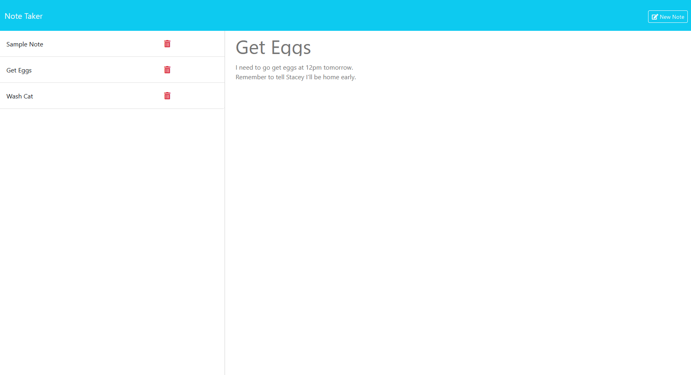

<h1 id='description'>Note Taker </h1> Note Taker is a privately hosted website that allows a user to take down any notes they like in plain text format. It works by writing new notes into the server's JSON database so that the user may access all of their notes whenever they want to. The site also features functionality to allow the user to delete any of their stored notes for when they don't need them anymore. <strong>Link:</strong> <a href=https://github.com/Shrcker/Note-Taker>Github Link</a>  <h3>Table of Contents</h3><ol><li><a href="#description">Description</a></li><li><a href="#usage">Usage</a></li><li><a href="#credits">Credits</a></li><li><a href="#license">License</a></li><li><a href="#questions">Questions</a></li><li><a href="#features">Features</a></li></ol> <h2 id='usage'> Usage</h2>  Either follow this <a href="https://tanias-note-taker-df5cd56a8d5d.herokuapp.com/">Link</a>, or download the source code and host on your own localhost server. <h2 id='credits'> Credits</h2>  Thanks goes to the EdX Bootcamp Program for providing the source code of this project. Everything front-end in this project was provided by them and my instructors, however all back-end/server-side functionality was written by me. <h2 id='license'> License</h2>  The MIT License <h2 id='questions'> Questions</h2>  Who is the project's host? It's Shrcker; link to their profile: 
    <a href="https://www.github.com/Shrcker">Link</a>  You can contact them through email: tanner.shirkey@gmail.com <h2 id='features'> Features</h2> Write and save plain text notes into a server database and be able to view it all at later time as well as delete unneeded notes.
